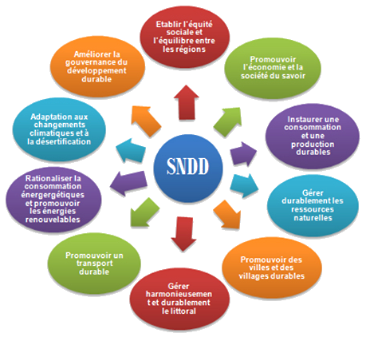

# SNDD, En France. 

Mise en œuvre par la France le 3 juin 2003 puis renouvelée et révisée le 
27 juillet 2010, la **stratégie nationale de développement durable** 
s'appuie sur des recommandations de **l'Organisation des Nations Unies**. 
Elle fixe des objectifs précis et quantifiés sur une 
période de 5 ans, et vise placer le développement durable 
comme enjeu majeur de la politique nationale. 

---

# SNDD, Plus précisément. 

La **Stratégie nationale de développement durable** se décompose en 10 
objectifs que nous allons étudier un à un. 

<!--  -->

---

#éduquer à l’environnement pour un développement durable

---

#aider le consommateur à devenir acteur du développement durable

---

#un dispositif fiscal incitatif pour aider à prendre en compte le pilier environnemental du développement durable

---

#définir une politique des transports plus durable

---

#un plan national santé environnement 2004-2008

---

#mieux prévenir les risques, les pollutions et les autres atteintes à la santé et à l’environnement en renforçant les contrôles

---

#la création d’un service de police judiciaire spécialisé pour mieux lutter contre les infractions à l’environnement et à la santé publique

---

#un État exemplaire moteur d’une société durable

---

#renforcer la gouvernance internationale du développement durable
